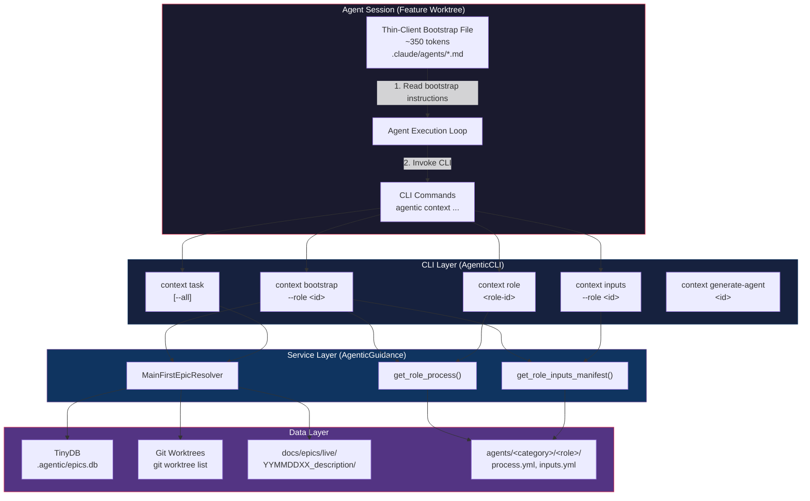
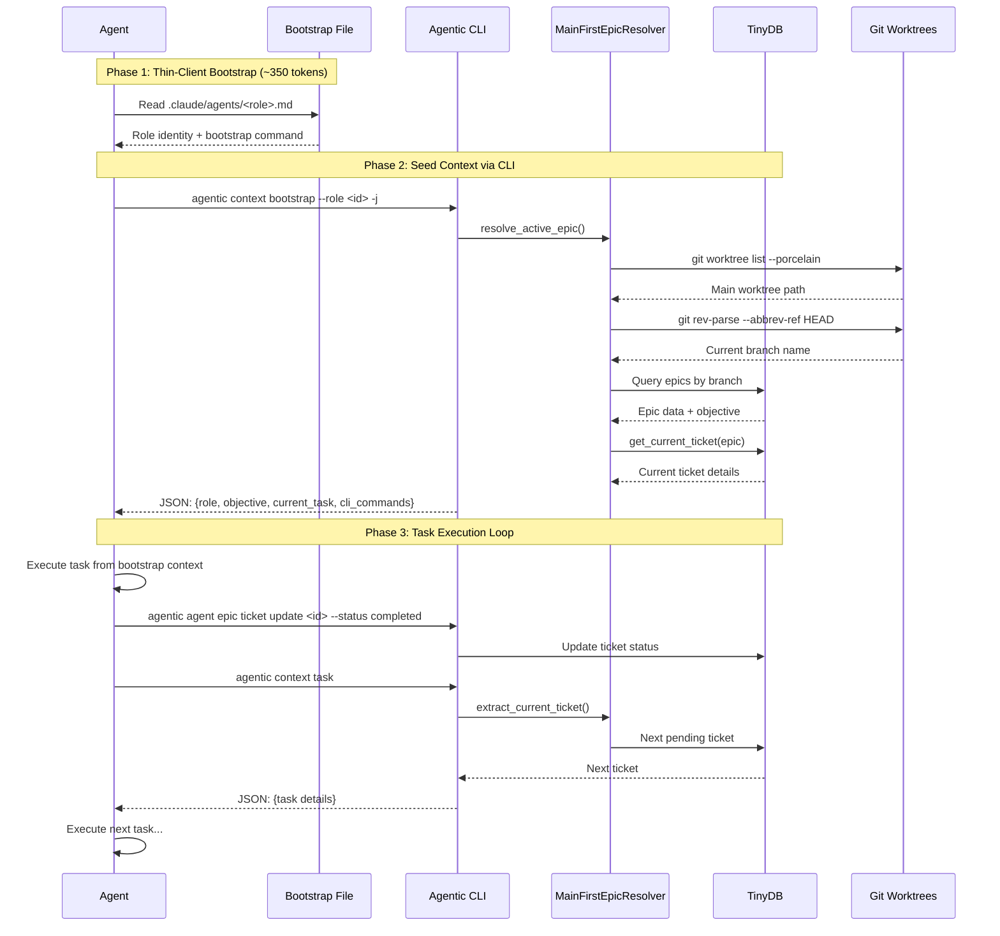
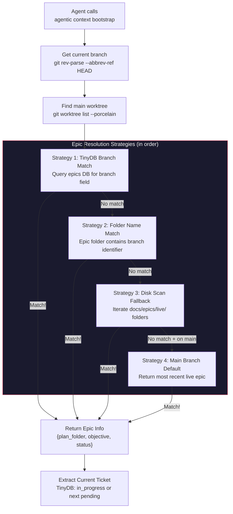
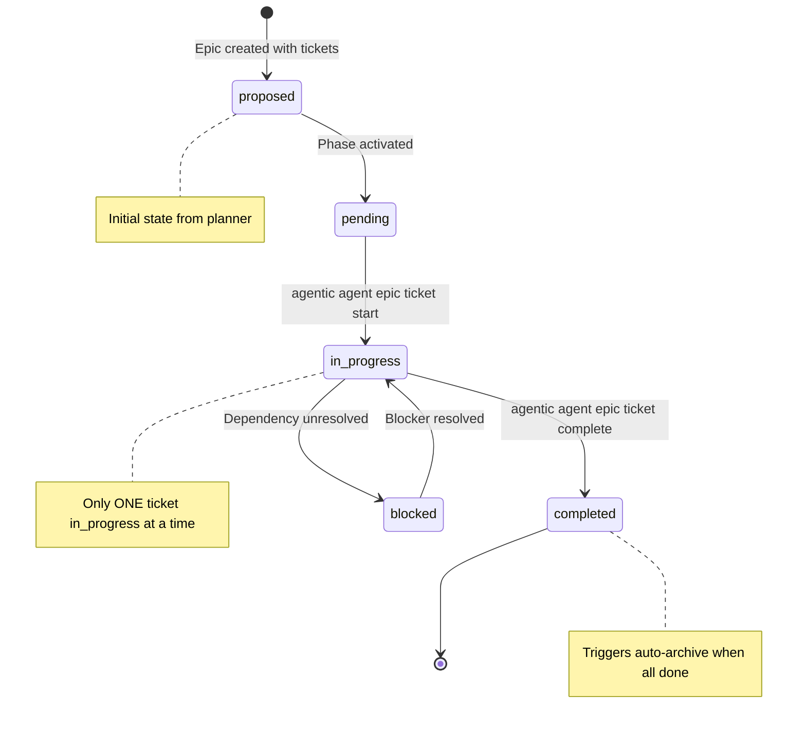
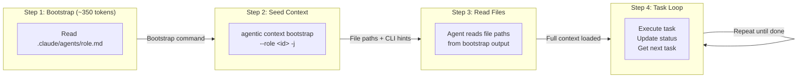
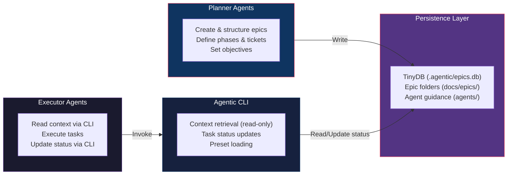

# JIT Context Architecture

## Overview

JIT (Just-In-Time) Context, also known as CCI (CLI Context Injection), is a **Pull-based** architecture for agent context retrieval. Instead of pre-loading large static markdown files at agent initialization (Push model), agents fetch exactly what they need on-demand via CLI commands (Pull model).

This architecture makes the Agentic CLI a first-class participant in context engineering, reducing initial token overhead by 75-90% while ensuring agents always operate with fresh, task-specific context.

---

## Push vs Pull Model

### Push Model (Legacy)

In the legacy architecture, each agent loaded a large static markdown file (~2000-5000 tokens) at session start containing all possible context: role description, process steps, guidelines, input manifests, and examples.

**Problems:**
- High "context tax" paid on every turn, even when irrelevant
- Stale guidance if files changed after agent initialization
- Agents in feature worktrees lost access to plans stored in main
- One-size-fits-all: no task-specific context loading

### Pull Model (JIT/CCI)

In the Pull model, agents receive a **thin-client bootstrap file** (~350 tokens) that instructs them to call CLI commands for their operational context. Context is fetched incrementally, on-demand, and always reflects the latest state.

**Benefits:**
- **Minimal initial token usage** - 75-90% reduction in context overhead
- **Zero stale guidance** - agents always pull the latest from CLI/TinyDB
- **Main-First harmony** - CLI resolves plans from main worktree regardless of where the agent runs
- **Task-specific loading** - agents fetch only what their current task requires
- **Traceability** - context retrieval is visible in the terminal

### Comparison

| Aspect | Push (Legacy) | Pull (JIT/CCI) |
|--------|--------------|-----------------|
| Initial context size | 2000-5000 tokens | ~350 tokens |
| Context freshness | Stale (loaded at init) | Current (fetched on demand) |
| Worktree awareness | None (file-local only) | Main-First resolution |
| Task specificity | All context, all the time | Only what's needed now |
| Error recovery | Reload entire context | Re-run specific command |
| Update propagation | Requires agent restart | Immediate on next CLI call |

---

## Architecture Components



---

## Agent Initialization Flow

The bootstrap sequence takes an agent from zero context to fully operational in a small number of CLI calls.



---

## CLI Command Reference

### Context Commands (`agentic context`)

| Command | Purpose | Key Output |
|---------|---------|------------|
| `bootstrap --role <id> [-j]` | **Primary entrypoint.** Returns Seed Context: role + objective + current task + CLI hints | `{role, objective, epic_folder, current_task, process, essential_inputs, cli_commands}` |
| `role <role-id> [-j]` | Get role-specific process and guidelines from `process.yml` | `{role_id, category, process, manifest, invocation_context}` |
| `task [--all] [-j]` | Get current task (or all tasks) from resolved epic | `{epic_folder, task}` or `{epic_folder, task_count, tasks}` |
| `inputs --role <id> [--resolve] [-j]` | Get input manifest with path resolution and existence checks | `{role, inputs: [{path, exists, description}], missing, layers}` |
| `generate-agent <id> [--output path]` | Generate thin-client bootstrap markdown file | Markdown content or file |

### Epic/Ticket Commands (`agentic agent epic ticket`)

| Command | Purpose |
|---------|---------|
| `list --epic <folder>` | List all tickets with status and phase |
| `start <id> --epic <folder>` | Mark ticket as `in_progress` |
| `complete <id> --epic <folder>` | Mark ticket as `completed` |
| `current --epic <folder>` | Get current in-progress or next pending ticket |

### Task Commands (`agentic plan task`)

| Command | Purpose |
|---------|---------|
| `list` | Show all tasks with status |
| `current` | Get in-progress or next pending task |
| `update <id> --status <s>` | Update task status |
| `prefill --preset <name>` | Load preset task template into TinyDB |
| `add <description>` | Add new task |

---

## Bootstrap Protocol

### Thin-Client Agent Files

Agent definition files in `.claude/agents/` are minimal (~350 tokens). They contain:

1. **Role Identity**: "You are the `<role-id>` agent."
2. **Bootstrap Command**: Instructions to run `agentic context bootstrap --role <id> -j`
3. **Execution Loop**: Read task, execute, update status, repeat

Example thin-client file:

```markdown
# Builder Agent

You are the **build-python** agent.

## Bootstrap Protocol

Before taking action, run these commands to get your context:

```bash
# 1. Get your role context and current task
agentic context bootstrap --role build-python -j

# 2. Get your current/next ticket details
agentic agent epic ticket current -j
```

## Execution Loop

1. Read current task from `agentic agent epic ticket current`
2. Execute the task following the guidance provided
3. Update status: `agentic agent epic ticket update <id> --status completed`
4. Repeat until all tasks are complete
```

### Bootstrap Output Structure

The `agentic context bootstrap` command returns:

```json
{
  "role": "build-python",
  "objective": "Implement feature X following the epic specification",
  "epic_folder": "260308PD_feature_implementation",
  "epic_path": "/home/code/Project/docs/epics/live/260308PD_feature_implementation",
  "current_task": {
    "id": "build_01",
    "name": "Implement core module",
    "description": "Create the main module with...",
    "status": "pending",
    "phase": "Build Phase",
    "agent_type": "build-python",
    "inputs": ["src/existing_module.py"],
    "target_files": ["src/new_module.py"],
    "guidance": "Follow existing patterns in...",
    "success_criteria": ["Tests pass", "No regressions"]
  },
  "process": {
    "role_id": "build-python",
    "category": "build",
    "process": { "...process.yml contents..." }
  },
  "essential_inputs": [
    {"path": "/abs/path/to/input.yml", "exists": true, "description": "Core inputs"}
  ],
  "cli_commands": {
    "task_prefill": "agentic plan task prefill --preset build-python",
    "task_status": "agentic plan task list",
    "task_update": "agentic plan task update <task-id> --status <status>",
    "task_current": "agentic context task"
  }
}
```

---

## Main-First Plan Resolution

### Problem

Epics are created and maintained in the **main branch/worktree** for centralized visibility (`docs/epics/live/`). But agents execute in **feature worktrees**. How does an agent in a feature worktree find its active epic?

### Solution: `MainFirstEpicResolver`

The resolver bridges the worktree gap by:

1. Detecting the main worktree via `git worktree list --porcelain`
2. Scanning `docs/epics/live/` in the main worktree
3. Matching the epic to the current branch using multiple strategies



### Branch-to-Folder Matching

Epic folders follow the `YYMMDDXX_description` naming convention (e.g., `260307EO_eliminate_mmd_tinydb_orchestration`). The resolver normalizes both the branch name and folder description (removing hyphens, underscores, case differences) and checks for substring containment.

| Strategy | How it Works | When Used |
|----------|-------------|-----------|
| TinyDB branch field | Exact match on stored branch metadata | Primary: most reliable |
| Folder name contains branch | Normalized substring matching | Fallback: when TinyDB branch is empty |
| Disk folder scan | Iterate live epic directories | Fallback: when TinyDB lookup fails entirely |
| Most recent on main | Sort folders descending, return first | Special case: agent on main/master branch |

---

## Task Lifecycle

Tasks (tickets) flow through a defined lifecycle managed by CLI commands and persisted in TinyDB.



### Task Data Model

Each ticket in TinyDB contains:

| Field | Description |
|-------|-------------|
| `id` | Unique ticket identifier (e.g., `build_01_001`) |
| `name` | Short description of the work |
| `description` | Detailed description |
| `status` | proposed, pending, in_progress, completed, blocked |
| `phase_name` | Phase grouping (e.g., "Build Phase") |
| `agent` | Agent type responsible (e.g., `build-python`) |
| `inputs` | List of input file paths |
| `target_files` | List of files to create/modify |
| `guidance` | Step-by-step implementation guidance |
| `success_criteria` | List of conditions for completion |

### Preset Templates

Task presets allow bulk-loading predefined task lists for common workflows:

```bash
# Load a preset task list
agentic plan task prefill --preset planner-build
```

Preset templates are YAML files stored at:
`modules/AgenticGuidance/assets/templates/presets/<preset-name>.yml`

---

## CCI Command Chaining Pattern

CCI uses **progressive disclosure**: each command's output includes hints for the next commands to run. This minimizes initial context while enabling agents to fetch exactly what they need.



### File Path Output Pattern

CLI commands output **file paths** rather than file contents. The agent reads the files it needs directly. This:

1. **Reduces CLI output size** - paths are compact; contents can be large
2. **Enables selective reading** - agent reads only what it needs
3. **Supports exploration** - agent can discover related files nearby
4. **Maintains freshness** - agent reads current file state, not cached content

---

## Separation of Concerns



| Responsibility | Owner | Access Pattern |
|---------------|-------|----------------|
| Epic/plan management (create, structure, phases) | Planner agents | Write to TinyDB |
| Context retrieval | CLI context commands | Read-only from TinyDB + filesystem |
| Task status updates | CLI ticket commands | Write status field only |
| Persistence layer | TinyDB + epic folders | Source of truth for all state |
| Task execution | Executor agents | Read via CLI, write code, update status via CLI |

The CLI is an **external memory / persistence layer**, NOT a planning engine.

---

## Generated Agent Files

The system supports 26+ thin-client agent files organized by category:

| Category | Agents | Count |
|----------|--------|-------|
| Planner | planner-build, planner-test, planner-audit, planner-explore, planner-orchestration, epic-creator | 6 |
| Build | build-python, build-flutter, build-docs-writer, build-story-writer | 4 |
| Test | test-builder, test-audit, test-uat, trace-explorer | 4 |
| Orchestration | orchestration-executor, orchestration-planning | 2 |
| Teacher | teacher-update-guidance, teacher-update-assets | 2 |
| Deploy | deploy-cicd | 1 |

Each file is **~350 tokens** (vs. ~2000-5000 in the legacy Push model).

Generate new agent files with:
```bash
agentic context generate-agent <role-id> --output .claude/agents/<role-id>.md
```

---

## Key Implementation Files

| File | Module | Purpose |
|------|--------|---------|
| `commands/context.py` | AgenticCLI | CLI command handlers for bootstrap, role, task, inputs |
| `services/context.py` | AgenticGuidance | `MainFirstEpicResolver`, `get_role_process()`, `get_role_inputs_manifest()` |
| `workflows/ticket_workflow.py` | AgenticCLI | `TicketPresetWorkflow` for task prefill from presets |
| `services/epic_repository.py` | AgenticGuidance | TinyDB backend for epic/ticket CRUD |
| `services/epic.py` | AgenticGuidance | `EpicService` domain logic |
| `services/ticket.py` | AgenticGuidance | `TicketService` domain logic |
| `templates/bootstrap-agent-template.md` | AgenticGuidance | Template for generating thin-client agent files |
| `templates/presets/*.yml` | AgenticGuidance | Preset task templates for bulk loading |

---

## Related Documentation

- [CCI Context Architecture](CCI_CONTEXT_ARCHITECTURE.md) - Detailed CCI patterns including self-review workflows
- [Agent Guidance Architecture](../modules/AgenticGuidance/docs/ARCHITECTURE.md) - Hub-and-spoke model, agent categories, input specifications
