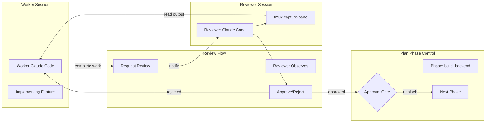

# Technical Proposal: Quality Gate / Code Review Agent Pattern

## Executive Summary

This proposal outlines the implementation of a Quality Gate pattern where a reviewer Claude Code agent must approve work before plan phases can proceed. The reviewer observes worker terminal output via `tmux capture-pane` and communicates approval/rejection through a file-based messaging system.

## Architecture Overview



## Core Components

### 1. ReviewService

**File:** `modules/AgenticGuidance/src/agenticguidance/services/review.py`

```python
from dataclasses import dataclass, field
from datetime import datetime
from enum import Enum
from pathlib import Path
from typing import Optional, List
import json
import uuid


class ReviewStatus(Enum):
    """Status of a review request."""
    PENDING = "pending"
    IN_REVIEW = "in_review"
    APPROVED = "approved"
    REJECTED = "rejected"
    TIMED_OUT = "timed_out"


@dataclass
class ReviewRequest:
    """A request for review of completed work."""

    review_id: str
    plan_folder: str
    phase_id: str
    task_id: Optional[str]
    worker_session: str
    reviewer_session: Optional[str]
    status: ReviewStatus
    requested_at: str
    reviewed_at: Optional[str] = None
    verdict: Optional[str] = None  # approved, rejected
    rejection_reason: Optional[str] = None
    metadata: dict = field(default_factory=dict)


class ReviewService:
    """Service for managing review requests and verdicts."""

    def __init__(self, review_dir: Optional[Path] = None):
        """Initialize review service."""
        if review_dir is None:
            review_dir = Path.home() / ".agentic" / "reviews"

        self.review_dir = review_dir
        self.inbox_dir = review_dir / "inbox"
        self.audit_dir = review_dir / "audit"
        self._ensure_directories()

    def request_review(
        self,
        plan_folder: str,
        phase_id: str,
        worker_session: str,
        reviewer_session: Optional[str] = None,
        task_id: Optional[str] = None,
    ) -> ReviewRequest:
        """Request a review for completed work.

        Args:
            plan_folder: The plan being worked on.
            phase_id: The phase requiring review.
            worker_session: Session that completed the work.
            reviewer_session: Optional designated reviewer session.
            task_id: Optional specific task ID.

        Returns:
            The created ReviewRequest.
        """
        review = ReviewRequest(
            review_id=str(uuid.uuid4()),
            plan_folder=plan_folder,
            phase_id=phase_id,
            task_id=task_id,
            worker_session=worker_session,
            reviewer_session=reviewer_session,
            status=ReviewStatus.PENDING,
            requested_at=datetime.now().isoformat(),
        )

        self._save_review(review)
        self._audit_log("request", review)

        return review

    def approve(self, review_id: str, reviewer: str) -> ReviewRequest:
        """Approve a review request.

        Args:
            review_id: The review to approve.
            reviewer: Session approving the review.

        Returns:
            The updated ReviewRequest.
        """
        review = self.get_review(review_id)
        if not review:
            raise ValueError(f"Review not found: {review_id}")

        review.status = ReviewStatus.APPROVED
        review.verdict = "approved"
        review.reviewer_session = reviewer
        review.reviewed_at = datetime.now().isoformat()

        self._save_review(review)
        self._audit_log("approve", review)

        return review

    def reject(
        self,
        review_id: str,
        reviewer: str,
        reason: str,
    ) -> ReviewRequest:
        """Reject a review request.

        Args:
            review_id: The review to reject.
            reviewer: Session rejecting the review.
            reason: Reason for rejection.

        Returns:
            The updated ReviewRequest.
        """
        review = self.get_review(review_id)
        if not review:
            raise ValueError(f"Review not found: {review_id}")

        review.status = ReviewStatus.REJECTED
        review.verdict = "rejected"
        review.reviewer_session = reviewer
        review.reviewed_at = datetime.now().isoformat()
        review.rejection_reason = reason

        self._save_review(review)
        self._audit_log("reject", review)

        return review

    def get_pending_reviews(
        self,
        reviewer_session: Optional[str] = None,
    ) -> List[ReviewRequest]:
        """Get all pending review requests.

        Args:
            reviewer_session: Optional filter by designated reviewer.

        Returns:
            List of pending ReviewRequests.
        """
        reviews = []
        for review_file in self.inbox_dir.glob("*.json"):
            try:
                review = self._load_review(review_file)
                if review.status == ReviewStatus.PENDING:
                    if reviewer_session is None or review.reviewer_session == reviewer_session:
                        reviews.append(review)
            except Exception:
                continue

        return sorted(reviews, key=lambda r: r.requested_at)

    def is_phase_approved(self, plan_folder: str, phase_id: str) -> bool:
        """Check if a phase has been approved.

        Args:
            plan_folder: The plan folder.
            phase_id: The phase ID.

        Returns:
            True if approved, False otherwise.
        """
        for review_file in self.inbox_dir.glob("*.json"):
            try:
                review = self._load_review(review_file)
                if (review.plan_folder == plan_folder and
                    review.phase_id == phase_id and
                    review.status == ReviewStatus.APPROVED):
                    return True
            except Exception:
                continue

        return False

    def _audit_log(self, action: str, review: ReviewRequest) -> None:
        """Write to audit log."""
        log_file = self.audit_dir / f"{datetime.now().strftime('%Y%m%d')}_reviews.log"
        entry = {
            "timestamp": datetime.now().isoformat(),
            "action": action,
            "review_id": review.review_id,
            "plan_folder": review.plan_folder,
            "phase_id": review.phase_id,
            "worker": review.worker_session,
            "reviewer": review.reviewer_session,
            "verdict": review.verdict,
        }
        with open(log_file, "a") as f:
            f.write(json.dumps(entry) + "\n")
```

### 2. Plan CLI Integration

**File:** `modules/AgenticCLI/src/agenticcli/commands/plan.py` (extension)

```python
def cmd_phase_update(args, plan_path: Path) -> None:
    """Update phase status with approval gate checking."""

    # ... existing code ...

    # Check for approval gate
    if new_status == "completed":
        phase_config = get_phase_config(plan_path, args.phase_id)

        if phase_config.get("requires_approval", False):
            from agenticguidance.services.review import ReviewService

            review_service = ReviewService()

            if not review_service.is_phase_approved(str(plan_path), args.phase_id):
                print_error(f"Phase '{args.phase_id}' requires approval before completion.")
                print("Request a review with: agentic review request --phase {args.phase_id}")
                sys.exit(1)

    # ... continue with status update ...
```

### 3. Review CLI Commands

**File:** `modules/AgenticCLI/src/agenticcli/commands/review.py`

```python
"""Review commands for quality gate workflow."""

import sys
from pathlib import Path


def handle(args, ctx=None):
    """Route review subcommands."""

    if args.review_command == "request":
        cmd_request(args)
    elif args.review_command == "approve":
        cmd_approve(args)
    elif args.review_command == "reject":
        cmd_reject(args)
    elif args.review_command == "status":
        cmd_status(args)
    elif args.review_command == "observe":
        cmd_observe(args)
    elif args.review_command == "audit":
        cmd_audit(args)
    else:
        print("Usage: agentic review <request|approve|reject|status|observe|audit>",
              file=sys.stderr)
        sys.exit(1)


def cmd_request(args):
    """Request a review for phase completion."""
    from agenticcli.console import print_success, print_json, is_json_output
    from agenticguidance.services.review import ReviewService

    service = ReviewService()

    review = service.request_review(
        plan_folder=args.plan,
        phase_id=args.phase,
        worker_session=args.worker or "current",
        reviewer_session=getattr(args, "reviewer", None),
        task_id=getattr(args, "task_id", None),
    )

    if is_json_output():
        print_json({"success": True, "review_id": review.review_id})
    else:
        print_success(f"Review requested: {review.review_id}")
        print(f"  Phase: {review.phase_id}")
        print(f"  Worker: {review.worker_session}")
        if review.reviewer_session:
            print(f"  Reviewer: {review.reviewer_session}")


def cmd_approve(args):
    """Approve a pending review."""
    from agenticcli.console import print_success, print_error
    from agenticguidance.services.review import ReviewService

    service = ReviewService()

    try:
        review = service.approve(
            review_id=args.review_id,
            reviewer=args.reviewer or "current",
        )
        print_success(f"Approved: {review.phase_id}")
    except ValueError as e:
        print_error(str(e))
        sys.exit(1)


def cmd_reject(args):
    """Reject a pending review."""
    from agenticcli.console import print_success, print_error
    from agenticguidance.services.review import ReviewService

    service = ReviewService()

    try:
        review = service.reject(
            review_id=args.review_id,
            reviewer=args.reviewer or "current",
            reason=args.reason,
        )
        print_success(f"Rejected: {review.phase_id}")
        print(f"  Reason: {review.rejection_reason}")
    except ValueError as e:
        print_error(str(e))
        sys.exit(1)


def cmd_status(args):
    """List pending reviews."""
    from agenticcli.console import console, print_json, is_json_output
    from agenticguidance.services.review import ReviewService

    service = ReviewService()

    reviews = service.get_pending_reviews(
        reviewer_session=getattr(args, "reviewer", None),
    )

    if is_json_output():
        print_json({"reviews": [
            {
                "review_id": r.review_id,
                "phase": r.phase_id,
                "worker": r.worker_session,
                "requested_at": r.requested_at,
            }
            for r in reviews
        ]})
    else:
        if not reviews:
            print("No pending reviews")
        else:
            console.print("[bold]Pending Reviews[/bold]")
            for r in reviews:
                console.print(f"  {r.review_id[:8]}... | {r.phase_id} | {r.worker_session}")


def cmd_observe(args):
    """Observe worker session terminal for review."""
    from agenticcli.console import console
    from agenticguidance.services.coordination import CoordinationService
    from agenticguidance.services.review import ReviewService

    review_service = ReviewService()
    coord_service = CoordinationService()

    # Get review to find worker session
    review = review_service.get_review(args.review_id)
    if not review:
        print(f"Review not found: {args.review_id}")
        sys.exit(1)

    # Capture worker terminal
    snapshot = coord_service.capture_terminal(
        review.worker_session,
        lines=getattr(args, "lines", 200),
    )

    console.print(f"[bold cyan]=== {review.worker_session} ({review.phase_id}) ===[/bold cyan]")
    console.print(snapshot.content)


def cmd_audit(args):
    """View review audit log."""
    from agenticcli.console import console
    from agenticguidance.services.review import ReviewService
    from datetime import datetime
    import json

    service = ReviewService()

    date = getattr(args, "date", None) or datetime.now().strftime("%Y%m%d")
    log_file = service.audit_dir / f"{date}_reviews.log"

    if not log_file.exists():
        print(f"No audit log for {date}")
        return

    console.print(f"[bold]Review Audit Log - {date}[/bold]")
    for line in log_file.read_text().strip().split("\n"):
        entry = json.loads(line)
        action = entry["action"]
        color = {"request": "yellow", "approve": "green", "reject": "red"}.get(action, "white")
        console.print(f"  [{color}]{action}[/{color}] {entry['phase_id']} ({entry['review_id'][:8]})")
```

## CLI Usage

### Request Review

```bash
# Worker requests review after completing phase
agentic review request \
    --plan 260130MA_feature \
    --phase build_backend \
    --worker worker-1 \
    --reviewer senior-reviewer
```

### Reviewer Workflow

```bash
# List pending reviews
agentic review status

# Observe worker's terminal
agentic review observe --review-id <id> --lines 300

# Or use coordination observe
agentic coord observe capture --session worker-1 --lines 300

# Approve
agentic review approve --review-id <id> --reviewer senior-reviewer

# Or reject with reason
agentic review reject --review-id <id> --reviewer senior-reviewer \
    --reason "Missing unit tests for edge cases"
```

### Plan Phase with Approval Gate

```yaml
# In plan_build.yml
phases:
  - name: Build Backend
    id: build_backend
    requires_approval: true  # <-- Enables quality gate
    tasks:
      - id: BB-001
        name: Implement API endpoints
```

```bash
# This will fail if not approved
agentic plan phase update --phase build_backend --status completed
# Error: Phase 'build_backend' requires approval before completion.

# After approval, it succeeds
agentic plan phase update --phase build_backend --status completed
# Success: Phase updated to completed
```

## File Storage

```
~/.agentic/reviews/
├── inbox/
│   └── {review_id}.json       # Review requests
└── audit/
    └── {YYYYMMDD}_reviews.log # Audit trail
```

### Review Request Format

```json
{
  "review_id": "550e8400-e29b-41d4-a716-446655440000",
  "plan_folder": "260130MA_feature",
  "phase_id": "build_backend",
  "task_id": null,
  "worker_session": "worker-1",
  "reviewer_session": "senior-reviewer",
  "status": "pending",
  "requested_at": "2026-01-30T15:30:00.000Z",
  "reviewed_at": null,
  "verdict": null,
  "rejection_reason": null
}
```

### Audit Log Format

```json
{"timestamp": "2026-01-30T15:30:00", "action": "request", "review_id": "550e8400...", "phase_id": "build_backend", "worker": "worker-1", "reviewer": null, "verdict": null}
{"timestamp": "2026-01-30T16:00:00", "action": "approve", "review_id": "550e8400...", "phase_id": "build_backend", "worker": "worker-1", "reviewer": "senior-reviewer", "verdict": "approved"}
```

## Integration Points

1. **Plan CLI (`plan.py`)**: `cmd_phase_update` checks approval before allowing completion
2. **CoordinationService**: `capture_terminal` used for reviewer observation
3. **Inbox Messaging**: Notifications sent when review requested/completed

## File Locations

| Component | File Path |
|-----------|-----------|
| ReviewService | `modules/AgenticGuidance/src/agenticguidance/services/review.py` (NEW) |
| Review CLI | `modules/AgenticCLI/src/agenticcli/commands/review.py` (NEW) |
| Plan CLI Integration | `modules/AgenticCLI/src/agenticcli/commands/plan.py` (MODIFY) |
| Unit Tests | `modules/AgenticGuidance/tests/test_services_review.py` (NEW) |

## Security Considerations

1. **Reviewer Authorization**: Currently any session can approve. Future: add allowed_reviewers list
2. **Audit Trail**: All actions logged with timestamps for accountability
3. **Timeout Handling**: Stale reviews can be auto-rejected after configurable timeout
