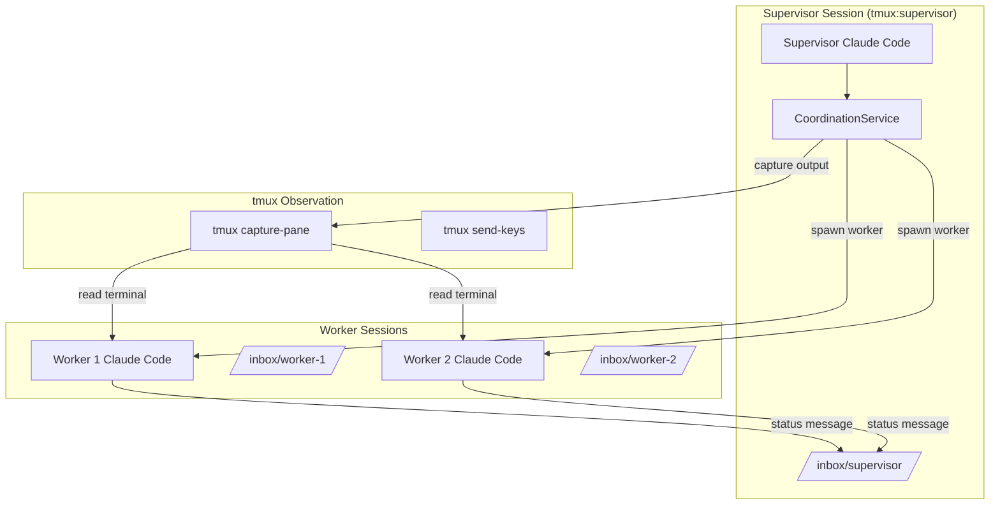

# Technical Proposal: Supervisor/Worker Multi-Agent Pattern

## Executive Summary

This proposal outlines the implementation of a Supervisor/Worker multi-agent coordination system using tmux as the underlying communication and observation substrate. The design extends the existing `SessionService` to support role-based sessions, file-based inter-session messaging (inbox pattern), and terminal output observation via `tmux capture-pane`.

## Architecture Overview



## Core Components

### 1. SessionRole Enum

```python
from enum import Enum

class SessionRole(Enum):
    """Role of a session in multi-agent coordination."""
    STANDALONE = "standalone"  # Default - independent session
    SUPERVISOR = "supervisor"  # Coordinates workers, observes output
    WORKER = "worker"          # Executes tasks, reports to supervisor
    OBSERVER = "observer"      # Read-only monitoring session
```

### 2. Extended SessionInfo

```python
@dataclass
class SessionInfo:
    """Extended information about a tmux session with role support."""

    name: str
    state: SessionState
    created_at: float
    attached: bool = False
    worktree: Optional[str] = None
    plan_folder: Optional[str] = None
    windows: int = 1
    metadata: dict = field(default_factory=dict)

    # New multi-agent coordination fields
    role: SessionRole = SessionRole.STANDALONE
    supervisor_session: Optional[str] = None  # For workers: name of supervisor
    worker_sessions: List[str] = field(default_factory=list)  # For supervisors
    inbox_path: Optional[str] = None
    task_id: Optional[str] = None  # Current task assignment
    last_heartbeat: Optional[float] = None
```

### 3. CoordinationService

**File:** `modules/AgenticGuidance/src/agenticguidance/services/coordination.py`

```python
class CoordinationService:
    """Service for coordinating multiple Claude Code sessions via tmux."""

    def __init__(
        self,
        coordination_dir: Optional[Path] = None,
        session_service: Optional[SessionService] = None,
    ):
        """Initialize coordination service."""
        if coordination_dir is None:
            coordination_dir = Path.home() / ".agentic" / "coordination"

        self.coordination_dir = coordination_dir
        self.inbox_dir = coordination_dir / "inbox"
        self.session_service = session_service or SessionService()

    # Supervisor Operations
    def create_supervisor(self, name: str, worktree: Optional[str] = None) -> SessionInfo:
        """Create a supervisor session."""

    def spawn_worker(
        self,
        supervisor_name: str,
        worker_name: str,
        task_description: str,
    ) -> SessionInfo:
        """Spawn a worker session under a supervisor."""

    def list_workers(self, supervisor_name: str) -> List[SessionInfo]:
        """List all workers for a supervisor."""

    # Terminal Observation
    def capture_terminal(
        self,
        session_name: str,
        lines: int = 200,
        pane: str = "0.0",
    ) -> TerminalSnapshot:
        """Capture terminal output from a session.

        Uses: tmux capture-pane -p -J -t session:window.pane -S -<lines>
        """

    def monitor_workers(self, supervisor_name: str) -> Dict[str, TerminalSnapshot]:
        """Capture terminal output from all workers."""

    def send_keys(self, session_name: str, keys: str, enter: bool = True) -> bool:
        """Send keystrokes to a session."""

    # Messaging
    def send_message(
        self,
        from_session: str,
        to_session: str,
        message_type: str,
        payload: dict,
    ) -> Message:
        """Send a message to a session's inbox."""

    def read_inbox(self, session_name: str) -> List[Message]:
        """Read messages from a session's inbox."""

    def report_status(
        self,
        worker_name: str,
        status: str,
        progress: Optional[float] = None,
    ) -> Message:
        """Worker reports status to supervisor."""
```

### 4. Message Schema

```python
@dataclass
class Message:
    """Inter-session message."""

    message_id: str
    from_session: str
    to_session: str
    message_type: str  # task, status, query, response, heartbeat
    payload: dict
    timestamp: str
    acknowledged: bool = False
```

**Storage format:** `~/.agentic/coordination/inbox/{session}/{message_id}.json`

```json
{
  "message_id": "550e8400-e29b-41d4-a716-446655440000",
  "from_session": "supervisor-1",
  "to_session": "worker-1",
  "message_type": "task",
  "payload": {
    "task_description": "Implement user authentication",
    "plan_folder": "260130MA_auth",
    "task_id": "AUTH-001"
  },
  "timestamp": "2026-01-30T15:30:00.000Z",
  "acknowledged": false
}
```

## CLI Commands

### Supervisor Commands

```bash
# Create a supervisor session
agentic coord supervisor create my-supervisor --worktree /path/to/project

# Spawn a worker under supervisor
agentic coord supervisor spawn-worker \
    --supervisor my-supervisor \
    --worker-name worker-1 \
    --task "Implement feature X"

# List workers
agentic coord supervisor list-workers --supervisor my-supervisor
```

### Observation Commands

```bash
# Capture terminal output from session
agentic coord observe capture --session worker-1 --lines 200

# Monitor all workers under a supervisor
agentic coord observe monitor --supervisor my-supervisor

# Send keys to a session
agentic coord observe send --session worker-1 --keys "ls -la"
```

### Worker Commands

```bash
# Report status to supervisor
agentic coord worker status --name worker-1 --status working --progress 50

# Read inbox messages
agentic coord worker inbox --name worker-1

# Acknowledge a message
agentic coord worker ack --name worker-1 --message-id <uuid>
```

## Example Workflow

### Supervisor Spawning Workers for Parallel Tasks

```bash
# 1. Create supervisor session
agentic coord supervisor create build-supervisor --plan 260130MA_build

# 2. Spawn workers for parallel build phases
agentic coord supervisor spawn-worker \
    --supervisor build-supervisor \
    --worker-name build-backend \
    --task "Build backend services"

agentic coord supervisor spawn-worker \
    --supervisor build-supervisor \
    --worker-name build-frontend \
    --task "Build frontend application"

# 3. Monitor workers
agentic coord observe monitor --supervisor build-supervisor

# 4. Check health
agentic coord status --supervisor build-supervisor
```

### Worker Processing Tasks

```python
# Inside a worker Claude Code session:

# 1. Poll inbox for tasks
messages = coordination_service.read_inbox("worker-1", message_type="task")

for msg in messages:
    # 2. Process task
    task = msg.payload["task_description"]

    # 3. Report progress
    coordination_service.report_status("worker-1", status="working", progress=25)

    # ... do work ...

    # 4. Report completion
    coordination_service.report_status(
        "worker-1",
        status="completed",
        result={"files_changed": ["src/foo.py"]}
    )

    # 5. Acknowledge message
    coordination_service.acknowledge_message("worker-1", msg.message_id)
```

## File Locations

| Component | File Path |
|-----------|-----------|
| SessionRole Enum | `modules/AgenticGuidance/src/agenticguidance/services/session.py` |
| CoordinationService | `modules/AgenticGuidance/src/agenticguidance/services/coordination.py` (NEW) |
| CLI Commands | `modules/AgenticCLI/src/agenticcli/commands/coordination.py` (NEW) |
| Unit Tests | `modules/AgenticGuidance/tests/test_services_coordination.py` (NEW) |

## Integration Points

1. **SessionService**: Extended with role field and role-based queries
2. **Plan CLI**: Can use coordination to spawn workers for phase tasks
3. **Orchestration Executor**: Can delegate to workers instead of sequential execution

## Implementation Phases

1. **Phase 1**: SessionRole enum and SessionInfo extension
2. **Phase 2**: CoordinationService with terminal capture
3. **Phase 3**: Inbox messaging system
4. **Phase 4**: CLI commands
5. **Phase 5**: Integration tests
