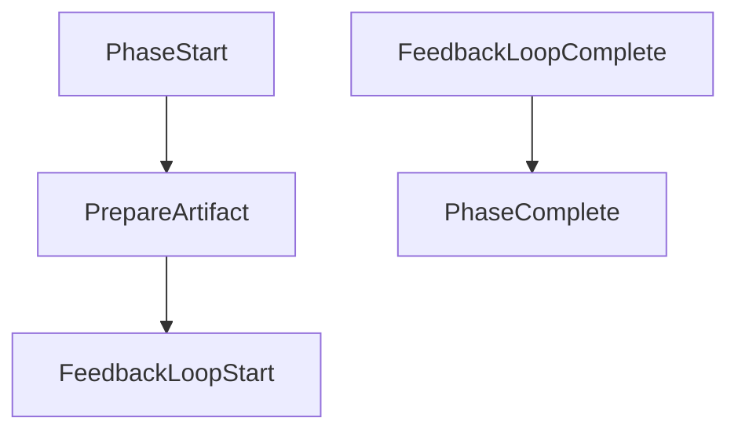

# Orchestration Components

Reusable Mermaid flowchart fragments that can be embedded inside any orchestration phase.

## What Are Components?

Components are **small, focused workflow patterns** that solve common orchestration problems. Unlike phase templates (which define entire phases like Build or Test), components are building blocks you combine to create custom flows.

**Key characteristics:**

- **Reusable** - Work in any orchestration type (build, guidance, cleanup)
- **Embeddable** - Insert inside phases, not standalone
- **Focused** - Solve one specific pattern
- **Composable** - Combine multiple components in one phase

## Components vs Phase Templates

| Aspect | Components | Phase Templates |
|--------|-----------|-----------------|
| Scope | Single pattern | Entire phase |
| Reusability | Any orchestration | Specific to phase type |
| Location | This folder | `orchestration/phase_templates/` |
| Example | Feedback loop | Build phase |
| Usage | Embed in phases | Reference for phase structure |

## Available Components

### feedback_loop.mmd

Generic iterative refinement with feedback capture. Use when any action needs review and potential revision.

```
Primary Agent -> Reviewer -> Feedback -> Apply -> Repeat
```

**Embed when:** Planning, building, writing - anything needing iterative improvement.

### approval_gate.mmd

Human approval checkpoint before proceeding. Presents context, waits for user decision, routes based on response.

```
Present Context -> Await Decision -> Route (Approve/Reject/Modify)
```

**Embed when:** Before destructive operations, deployments, or high-risk decisions.

### audit_test_fix_loop.mmd

Test quality validation and reward hacking detection. Based on the mandatory audit-test-fix-loop from agent-loops.yml.

```
Audit Tests -> Classify Issues -> Fix -> Re-run -> Repeat
```

**Embed when:** After test phases to ensure tests are meaningful and valid.

### guidance_self_review_loop.mmd

Iterative guidance improvement through agent self-review. Agents review their own guidance files, report issues, and fixes are applied.

```
Self-Review (Parallel) -> Collect Issues -> User Decisions -> Fix -> Repeat
```

**Embed when:** Improving guidance for multiple agents based on identified friction.

### guidance_blind_test.mmd

Validates guidance effectiveness by spawning agents without hints. If you have to tell the agent what to do, the guidance failed.

```
Baseline -> Apply Changes -> Blind Spawn -> Evaluate -> Iterate
```

**Embed when:** After guidance changes to verify they actually work.

## When to Use Components

**DO use components when:**

- You need a common pattern (feedback, approval, validation)
- The pattern appears in multiple places in your orchestration
- You want consistent handling of iteration/escalation

**DO NOT use components when:**

- You need a complete phase structure (use phase templates instead)
- The pattern is highly specific to one use case
- Adding the component would over-complicate simple flows

## How to Embed Components

Reference a component in your orchestration by:

1. Including the component subgraph in your phase
2. Connecting entry/exit points to your phase flow
3. Providing required inputs from your phase context

Example embedding in a phase:



## Loop Definitions

Components that implement loops reference their definitions in:
`modules/AgenticGuidance/assets/definitions/agent-loops.yml`

Always check the loop definition for:
- Maximum iterations
- Exit conditions
- Escalation behavior
